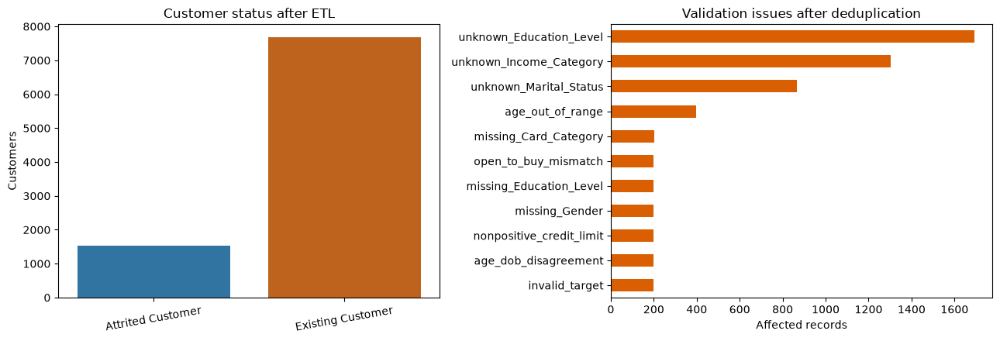
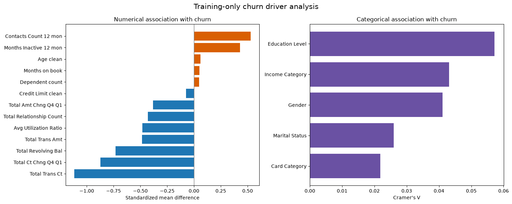
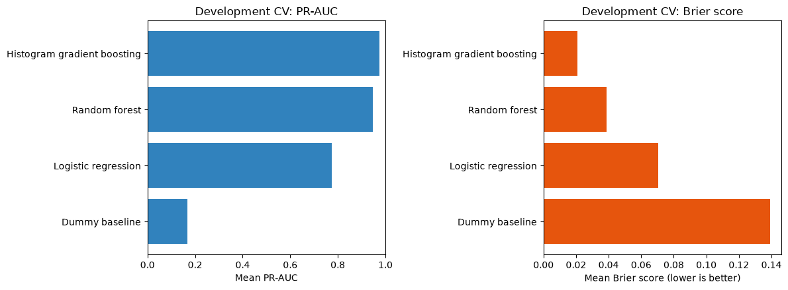
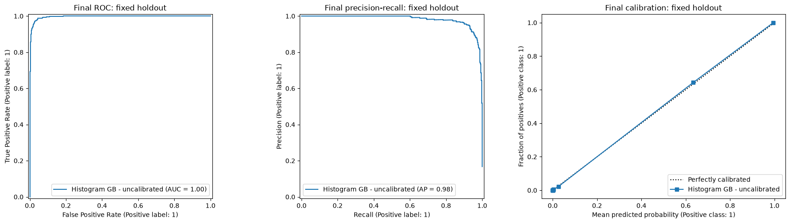
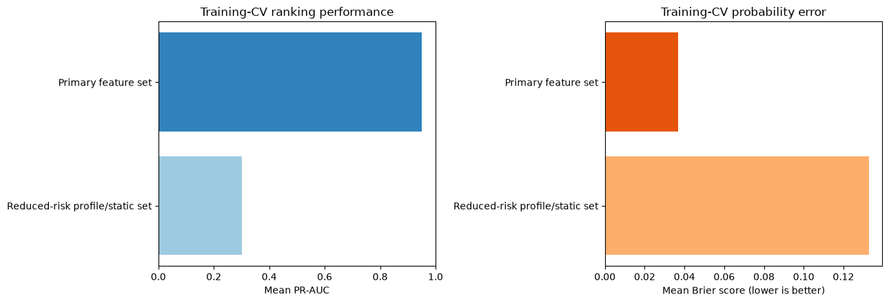

# Customer Churn Prediction

Predicts which credit card customers are likely to churn, with a full data
quality audit, a churn-driver analysis, and a Streamlit app to try the model
live.

## What's here

- **`customer_churn_project.ipynb`**: the full analysis, data validation,
  cleaning, churn-driver analysis, model selection, holdout evaluation, an
  at-risk customer list, and a win-back priority list for customers who've
  already churned.
- **`app/`**: a small Streamlit app that loads the trained model and lets
  you score a hypothetical customer interactively.

## Data quality audit

12,126 raw records → 11,725 after removing 401 exact duplicates → 11,525
with a usable churn label. Eleven independent validation rules (invalid
target values, out-of-range ages, non-positive credit limits, missing or
`Unknown` categories, an age-vs-date-of-birth cross-check, credit-limit
floor/ceiling censoring, and more) flag 4,644 rows, 39.6% of the
deduplicated data. Checking for overlap between flags shows they're fully
disjoint: zero records are hit by more than one rule, which rules out a
single corrupted batch and points to independent, field-level defects
instead.



## Key drivers of churn

Transaction activity separates churners from non-churners more than
anything else: customers who churn transact less often, spend less, and
change their spending pattern more sharply quarter-over-quarter. Relationship
tenure and product count matter, but far less than raw activity.



## Modeling approach

- 16.70% churn rate (1,540 of 11,525 labeled customers), handled through
  model comparison on PR-AUC rather than resampling or reweighting.
- Four candidates compared with 5-fold stratified CV on the development
  split: a dummy baseline, logistic regression, random forest, and histogram
  gradient boosting. HGB wins on mean CV PR-AUC, 0.974 vs. 0.947 for the
  random forest.
- Model *family* selection and probability *calibration* selection are two
  separate, guardrail-gated decisions: a challenger only replaces the
  incumbent if it improves PR-AUC, Brier score, and top-decile lift at the
  same time, decided before the holdout is touched.



## Results on a frozen holdout

The holdout set was carved off before any model selection and touched
exactly once, at the end. Metrics below are bootstrap 95% confidence
intervals over that single evaluation:

| Metric | Value (95% CI) |
|---|---|
| ROC-AUC | 0.996 (0.994–0.998) |
| PR-AUC | 0.982 (0.974–0.989) |
| Top-10% precision / lift | 100% / 5.99x |
| Expected calibration error | 0.002 |



## How much of that is real, and how much is just transaction data?

Permutation importance shows the model leans almost entirely on two
features: shuffling total transaction count alone costs 0.45 of holdout
PR-AUC, and total transaction amount another 0.30, an order of magnitude
more than every other feature (the next-highest, relationship count, costs
just 0.036). That's the honest caveat: this snapshot can't confirm whether
that drop in activity is an early warning sign or just what a customer who's
already checked out looks like.

Retraining on a timing-safe feature set (age, dependents, credit limit, and
demographics only, no transaction or utilization fields) drops PR-AUC from
0.982 to 0.284 on the same holdout.



Out-of-time validation (training on one period, scoring on a later one)
is the natural next step before this goes anywhere near production. See
section 17 of the notebook for the full discussion.

## Running the notebook

```bash
pip install -r requirements.txt
jupyter notebook customer_churn_project.ipynb
```

## Running the app

```bash
cd app
pip install -r requirements.txt
python train_model.py   # only needed if model.joblib isn't already present
streamlit run app.py
```

## Project structure

```
customer-churn-prediction/
├── customer_churn_project.ipynb
├── requirements.txt
├── images/
└── app/
    ├── app.py
    ├── train_model.py
    ├── requirements.txt
    ├── model.joblib
    ├── model_metadata.json
    └── credit-card_customers.xlsx
```
